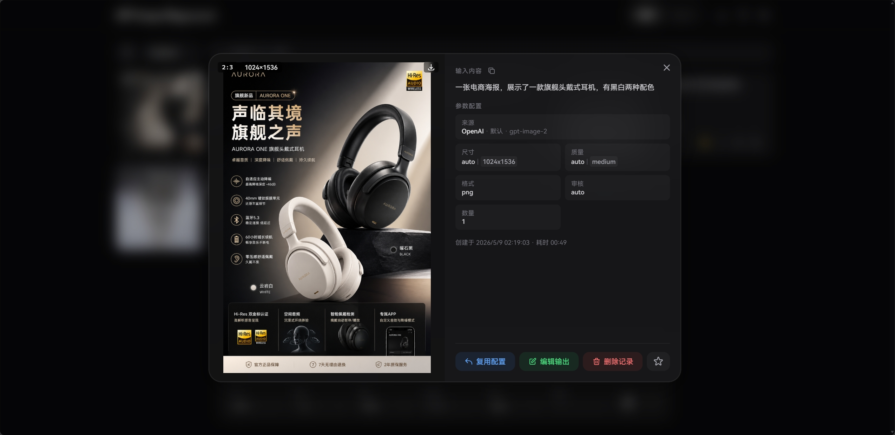
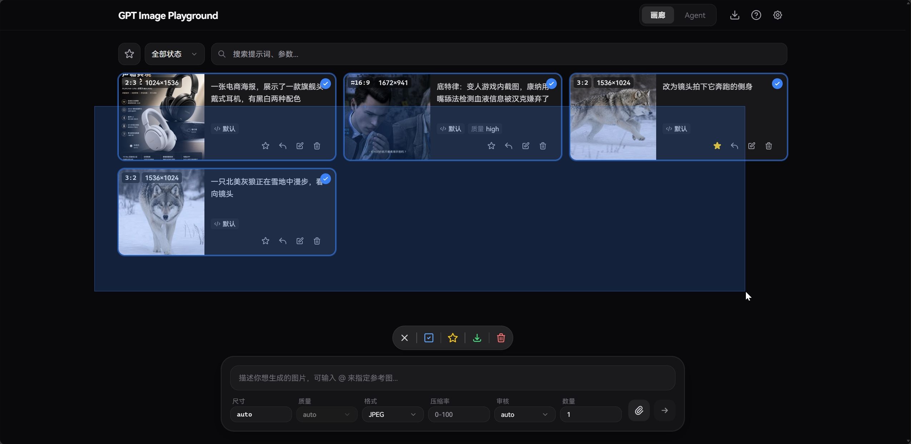
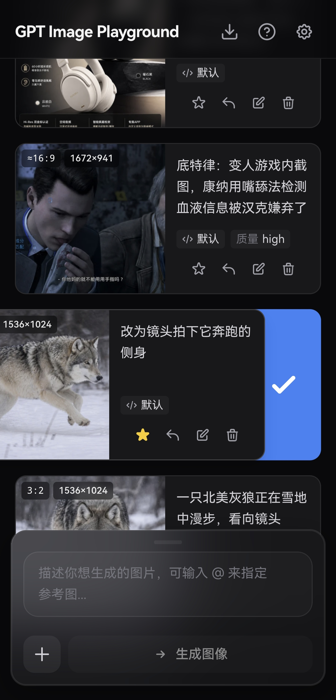

<div align="center">

# 🎨 picpilot

[](LICENSE)
[](https://react.dev/)
[](https://www.typescriptlang.org/)
[](https://nodejs.org/)
[](https://go.dev/)
[](https://go-chi.io/)
[](#-核心特性)

**面向电商商品图的自托管 AI 图片生成与编辑工作台**

简洁精美的 Web UI，支持 OpenAI / OpenAI 兼容接口与可导入的自定义 HTTP 服务商。<br>
涵盖文本生图、参考图与遮罩编辑、多轮 Agent 对话；个人历史与图片纯本地存储（IndexedDB），<br>
并内置多用户团队能力：邀请注册、共享画廊、用量统计与管理后台。

</div>

---

## 📸 界面预览

<details>
<summary><b>点击展开截图展示</b></summary>
<br>

<div align="center">
  <b>桌面端主界面</b><br>
  
</div>

<br>

<div align="center">
  <b>任务详情与实际参数</b><br>
  
</div>

<br>

<div align="center">
  <b>桌面端批量选择</b><br>
  
</div>

<br>

<div align="center">
  <b>桌面端 Agent 模式</b><br>
  
</div>

<br>

<div align="center">
  <b>移动端主界面</b><br>
  
</div>

<br>

<div align="center">
  <b>移动端侧滑多选</b><br>
  
</div>

</details>

---

## ✨ 核心特性

### 🎨 强大的图像生成与编辑
- **参考图与遮罩**：支持上传最多 16 张参考图（支持剪贴板和拖拽）。内置可视化遮罩编辑器，自动预处理以符合官方分辨率限制。
- **批量与迭代**：支持单次多图生成；一键将满意结果转为参考图，无缝开启下一轮修改。
- **流式生成预览**：`Images API` 与 `Responses API` 模式均支持流式接收中间步骤图像，缓解连接超时问题。

### 🤖 Agent 多轮对话模式
- **多轮对话与上下文记忆**：基于 Responses API 的对话式生成，Agent 会理解上下文并按需调用图像工具；支持 `@` 引用参考图或前面轮次生成的图片，并自动识别上下文中的图片。
- **并发批量生成**：内置 `generate_image_batch` 工具，让 Agent 在一次轮次中并发生成多张关联图像，并通过 `continue_generation` 自动追加新一轮以处理依赖关系。
- **分支与重新生成**：编辑某轮消息重新发送或重新生成某轮消息会产生可切换的分支，引用解析严格限定在当前分支路径内，避免误用其他分支的图片。
- **画廊同步与隔离删除**：Agent 生成的图片会同步到画廊；删除对话默认保留画廊记录，删除画廊任务时也会自动清理对话中残留的图片引用。
- **可选 Web 搜索**：可开启 `web_search` 工具，Agent 会在需要时搜索网络信息并附带引用链接。

### ⚙️ 精细化参数追踪
- **智能尺寸控制**：提供 1K/2K/4K 快速预设，自定义宽高时会自动规整至模型安全范围（16 的倍数、总像素校验等）。
- **实际参数对比**：自动提取 API 响应中真实生效的尺寸、质量、耗时以及**模型改写后的提示词**，与你的请求参数高亮对比。支持定制化的参数列表横向平滑滚动体验。

### 📁 高效历史管理 (纯本地)
- **瀑布流与画廊**：历史任务自动保存，支持按状态过滤、全屏大图预览与快捷下载。
- **快捷批量操作**：桌面端支持鼠标拖拽框选、Ctrl/⌘ 连选，移动端支持顺滑侧滑多选；轻松实现批量收藏与清理。
- **优化的图片查看与下载**：大图预览支持左右滑动切换、移动端长按弹出操作菜单，支持快捷下载与批量下载。
- **极致性能与隐私**：所有记录与图片均存放在浏览器 IndexedDB 中（采用 SHA-256 去重压缩），不经过任何第三方服务器。支持一键打包导出 ZIP 备份。

### 🔌 多配置与服务商增强
- **多配置管理**：支持创建并保存多个 API 配置（服务商 / 模型 / 接口模式 等），按需快速切换；支持一键复制当前配置到列表底部，并通过拖拽对配置列表与服务商列表进行自定义排序。**上游地址 (`base_url`) 与 API Key 由部署侧 env var 统一管理，用户在前端不可见、不可改。**
- **多服务商接入**：内置 OpenAI 兼容接口（含 `Images API` 和 `Responses API`），并支持通过 JSON 导入自定义 HTTP 服务商配置（团队代理模式下仅支持同步返回图片的接口）。
- **团队 API 代理**：所有 OpenAI 兼容请求一律走同源 `/api-proxy/` 路径，由服务端按当前登录用户校验后转发到 `API_PROXY_URL` 指定的上游，自动注入 `API_PROXY_API_KEY`。前端不暴露真实上游地址。
- **Codex CLI 兼容模式**：对上游为 Codex CLI 的 API，开启后应用 Codex CLI 实际支持的参数，并将多图生成拆分为并发单图。
- **提示词防改写**：Responses API 会始终在请求文本前加入强制指令防止提示词被改写；开启 Codex CLI 模式后，Images API 也会获得同等保护。
- **智能诊断提示**：当检测到接口异常改写行为或缺少常规参数时，自动提示开启相应的兼容模式。
- **习惯配置**：支持设置提交后清空输入、重启后保留历史输入、临时复用历史任务 API 配置等。

### 👥 团队与多用户（自托管后端）
- **邀请码注册与会话安全**：邀请码注册（管理员可批量生成，设有效期 / 使用次数）；JWT 短时令牌 + 过期前静默刷新的滑动会话（默认 2h 有效、7d 绝对上限），重置密码即令该用户全设备登出。
- **管理后台**：用户管理（启用 / 禁用、管理员授权、重置密码、删除），邀请码管理，团队服务配置（默认批量上限、全局并发与排队上限，**运行时生效、无需重启**），用量概览与请求事件流水（支持 CSV 导出）。
- **共享画廊**：可将满意作品一键公开到团队画廊（自动附带本次引用的原图），管理员可「推荐」置顶或撤下违规图；每用户独立存储配额。
- **统一上游代理**：所有出图请求经同源 `/api-proxy/` 由服务端鉴权后转发，真实上游地址与 Key 仅存于服务端、前端永不可见；全局并发信号量 + FIFO 排队，配套「当前 N 个排队中」可见性与一键取消。
- **站内通知**：图片被公开 / 撤下 / 推荐等事件以站内通知触达本人。

---

## 🚀 部署与使用

支持多种部署与开发方式。团队上游 API 节点统一由服务端环境变量管理；前端只接收非凭据配置。

<details>
<summary><strong>☁️ 方式一：Cloudflare Workers 部署</strong></summary>

项目已内置 Wrangler 配置，可将 Vite 构建产物作为 Cloudflare Workers 静态资源部署。

**1. 登录 Cloudflare**

```bash
npx wrangler login
```

**2. 部署到 Workers**

```bash
npm run deploy:cf
```

部署脚本会先执行 `npm run build`，再通过 `wrangler deploy` 上传 `dist/` 目录。

**导入默认自定义服务商配置**：Cloudflare Workers 的环境变量不会自动改写已经构建好的静态文件。若需在页面启动后自动导入自定义服务商配置，请在构建前将 `VITE_DEFAULT_API_URL` 设为 `.json` 配置 URL 或带 `settings` 参数的分享 URL 后再部署。

```bash
VITE_DEFAULT_API_URL=https://example.com/picpilot-provider.json npm run deploy:cf
```

PowerShell 示例：

```powershell
$env:VITE_DEFAULT_API_URL="https://example.com/picpilot-provider.json"; npm run deploy:cf
```

> 普通 API 地址不会写入前端配置；真实上游地址与 Key 始终由服务端 `API_PROXY_URL` / `API_PROXY_API_KEY` 决定。

</details>

<details>
<summary><strong>🐳 方式二：Docker 部署</strong></summary>

> 📖 **VPS 完整部署指南（含 Caddy + CLIProxyAPI + DockerCopilot）**：[docs/vps_deploy.md](docs/vps_deploy.md)

Docker 部署建议把上游凭据放在服务端环境变量里。PicPilot 当前由 `frontend` 与 `auth` 两个容器组成；如果同一台服务器上还部署 CLIProxyAPI，推荐把它们放进同一个 Docker Compose 网络，由 `auth` 通过服务名访问 CLIProxyAPI。

**环境变量说明：**

> 完整模板见 [`deploy/.env.example`](deploy/.env.example)，下面按重要性分组列出。

**必填**

| 变量 | 说明 | 示例 |
|------|------|------|
| `JWT_SECRET` | JWT 签名密钥 | `openssl rand -hex 32` 生成 |
| `ADMIN_USERS` | 管理员账号，格式 `用户名:密码` | `admin:your-password` |
| `API_PROXY_URL` | 上游 API 地址，需写到 `/v1` | `http://cli-proxy-api:8317/v1` |
| `API_PROXY_API_KEY` | 上游 API Key | `your-api-key` |

**可选**

| 变量 | 说明 | 默认值 |
|------|------|--------|
| `DEFAULT_API_URL` | 自定义服务商 JSON 配置 URL | 空 |
| `DEFAULT_MAX_BATCH_IMAGES` | 单次批量上限 | `10` |
| `PER_USER_PUBLIC_QUOTA_BYTES` | 公开画廊存储配额 | `524288000` (500MB) |
| `EVENT_RETENTION_DAYS` | 事件保留天数 | `30` |
| `JWT_EXPIRES_IN_SECONDS` | 访问令牌有效期（前端自动续期，过期前静默刷新） | `7200` (2小时) |
| `JWT_SESSION_MAX_SECONDS` | 会话绝对上限（从登录起算，到点必须重新登录） | `604800` (7天) |
| `HOST` / `PORT` | 监听地址和端口 | `0.0.0.0:80` |

> 💡 **上游地址与 Key 仅在 env var 里**：前端用户不能也不需要在设置里填 `base_url` 或 `API Key` —— 所有 OpenAI 兼容请求一律走同源 `/api-proxy/...`，由服务端读 `API_PROXY_URL`/`API_PROXY_API_KEY` 后转发。

> 💡 **`/v1` 路径规则**：`API_PROXY_URL` 推荐写到 `/v1`。服务端会容忍外部请求路径里也带 `/v1` 的情况，例如 `/api-proxy/v1/models` 会转成上游 `/v1/models`，不会拼成 `/v1/v1/models`。

**1. 快速开始（推荐）**

适用于同时部署 PicPilot + CLIProxyAPI + Caddy。

```bash
# 克隆仓库
git clone https://github.com/xxww0098/picpilot.git
cd picpilot

# 创建环境变量
cp deploy/.env.example deploy/.env
# 编辑 deploy/.env，填入 JWT_SECRET、ADMIN_USERS、API_PROXY_URL、API_PROXY_API_KEY

# 启动
docker compose -f deploy/docker-compose.yml up -d --build
```

**2. 完整 docker-compose.yml 示例**

```yaml
services:
  # 外部 Caddy - 处理 HTTPS 和域名路由
  caddy:
    image: caddy:2-alpine
    restart: unless-stopped
    command: ["caddy", "reverse-proxy", "--from", "${PUBLIC_ORIGIN:-localhost}", "--to", "frontend:80"]
    ports:
      - "80:80"
      - "443:443"
    volumes:
      - caddy_data:/data
      - caddy_config:/config
    depends_on:
      - frontend
    networks:
      - picpilot_net

  # PicPilot 前端
  frontend:
    build:
      context: .
      dockerfile: deploy/Dockerfile
    restart: unless-stopped
    environment:
      - DEFAULT_API_URL=${DEFAULT_API_URL:-}
    depends_on:
      - auth
    expose:
      - "80"
    networks:
      - picpilot_net

  # PicPilot 认证 API
  auth:
    build:
      context: ./server
      dockerfile: Dockerfile
    restart: unless-stopped
    environment:
      - ADMIN_USERS=${ADMIN_USERS}
      - JWT_SECRET=${JWT_SECRET}
      - JWT_EXPIRES_IN_SECONDS=${JWT_EXPIRES_IN_SECONDS:-7200}
      - EVENT_RETENTION_DAYS=${EVENT_RETENTION_DAYS:-30}
      - PER_USER_PUBLIC_QUOTA_BYTES=${PER_USER_PUBLIC_QUOTA_BYTES:-524288000}
      - DEFAULT_MAX_BATCH_IMAGES=${DEFAULT_MAX_BATCH_IMAGES:-10}
      - API_PROXY_URL=${API_PROXY_URL:-}
      - API_PROXY_API_KEY=${API_PROXY_API_KEY:-}
      - DATA_DIR=/data
      - DB_PATH=/data/auth.db
    volumes:
      - picpilot_auth_data:/data
    expose:
      - "3001"
    networks:
      - picpilot_net

  # CLIProxyAPI（可选）
  cli-proxy-api:
    image: eceasy/cli-proxy-api:latest
    restart: unless-stopped
    volumes:
      - ./cliproxy/config.yaml:/CLIProxyAPI/config.yaml:ro
      - ./cliproxy/auths:/root/.cli-proxy-api
      - ./cliproxy/logs:/CLIProxyAPI/logs
    expose:
      - "8317"
    networks:
      - picpilot_net

networks:
  picpilot_net:

volumes:
  caddy_data:
  caddy_config:
  picpilot_auth_data:
```

**3. 验证部署**

```bash
# 检查容器状态
docker compose ps

# 测试登录
curl -X POST http://localhost:3001/api/auth/login \
  -H "Content-Type: application/json" \
  -d '{"username":"admin","password":"your-password"}'

# 验证 CLIProxyAPI 连通性（如果部署了）
docker compose exec auth node -e "
  const r = await fetch('http://cli-proxy-api:8317/v1/models', {
    headers: { authorization: 'Bearer ' + process.env.API_PROXY_API_KEY }
  });
  console.log(r.status, await r.text());
"
```

如果返回 `200`，说明 PicPilot 到 CLIProxyAPI 的内网链路与 Key 都正常。

</details>

<details>
<summary><strong>💻 方式三：本地开发与静态构建</strong></summary>

**1. 环境准备与启动**

本项目使用 Node.js / npm 驱动。你可以在项目根目录新建 `.env.local` 文件，用 `VITE_DEFAULT_API_URL` 配置默认导入的自定义服务商 JSON 或分享 URL。前端热更新开发可运行：

**导入自定义服务商配置**：`VITE_DEFAULT_API_URL` 设为 `.json` 配置 URL 或带 `settings` 参数的分享 URL 时，页面启动后会自动导入其中的自定义服务商和 API 配置。普通 API 地址不会写入前端配置。

```bash
npm install
npm run dev
```

如果需要一键执行“安装依赖 -> 构建 -> 预览静态产物”，可运行：

```bash
npm run start:local
```

`start:local` 会构建前端产物，然后启动单个 Hono 应用服务：Hono 同时负责 `/api/*` 接口和 `dist/` 静态文件，因此访问 `http://localhost:3001` 会显示登录界面。默认本地管理员为 `admin` / `admin`；如需自定义，可在启动前设置 `ADMIN_USERS="用户名:密码"` 和 `JWT_SECRET="长随机字符串"`。

**2. 本地开发跨域代理 (可选)**

如果在本地开发时遇到浏览器的 CORS 限制，可开启本地代理转发：

```bash
cp dev-proxy.config.example.json dev-proxy.config.json
```

修改 `dev-proxy.config.json`，将 `target` 设置为真实的完整 API 基础地址（OpenAI 兼容接口需要填到 `/v1` 版本前缀）。重启开发服务器后，所有 `/api-proxy/...` 请求会被转发到该 `target`。仅 `npm run dev` 阶段生效，不影响构建产物。

**3. 本地故障模拟 API (可选)**

如果需要复现图片 URL 跨域、接口返回结构异常、原始响应查看等问题，可启动内置模拟服务：

```powershell
npm run mock:api
```

使用方式见 [本地故障模拟 API](docs/mock-image-api.md)。

**4. 构建静态产物**

```bash
npm run build
```

构建会先执行前端、Node 配置脚本和 Service Worker 的 TypeScript 检查；如需连同服务端一起检查，可运行 `npm run typecheck:all`。构建输出的文件位于 `dist/` 目录下，可将其部署至任何静态文件服务器（如 Caddy、GitHub Pages、Netlify 等）。

</details>

---

## 🛠️ URL 传参快速填充

应用支持通过 URL 查询参数快速填入配置，非常适合创建书签或集成分享。根据你的服务商类型，选择对应的方式：

**方式一：标准 OpenAI 兼容服务商**
直接使用简短的查询参数预填非凭据字段：
- `?apiMode=images` 或 `?apiMode=responses`（未传时默认为 `images`）
- `?model=gpt-image-2`（未传时按 `apiMode` 使用默认模型）
- `?codexCli=true`（开启 Codex CLI 兼容模式）
- `?streamImages=true` / `?streamPartialImages=2`

> 上游地址与 API Key 由部署侧 env var 管理，URL 参数里不再支持 `apiUrl` / `apiKey`（旧链接里这两个参数会被静默忽略）。

**方式二：自定义格式服务商**
如果需要导入自定义格式的 API 配置，请使用 `settings` 参数并传入 URL 编码后的完整 JSON：
- `?settings={URL编码后的JSON}`（只读取 `customProviders` 和 `profiles` 列表，profile 里的 `baseUrl` / `apiKey` 会被丢弃）

> 推荐先在项目内完成配置生成与导入：
>
> **设置 - API 配置 - 服务商类型 - 创建自定义服务商 - AI 一键生成与导入**
>
> 完成后可在 **API 配置 - 当前连接配置** 使用右侧快捷按钮：
>
> - **链接按钮**：一键复制可分享的导入 URL（仅包含 profile 名称、模型、接口模式等非凭据字段）。
> - **复制按钮**：将当前配置复制一份到配置列表底部，新配置名称会追加"（复制）"。

JSON 结构示例：

```json
{
  "customProviders": [
    {
      "id": "custom-example-sync",
      "name": "示例同步服务商",
      "submit": {
        "path": "images/generations",
        "method": "POST",
        "contentType": "json",
        "body": {
          "model": "$profile.model",
          "prompt": "$prompt",
          "size": "$params.size",
          "quality": "$params.quality",
          "output_format": "$params.output_format",
          "output_compression": "$params.output_compression",
          "n": "$params.n"
        },
        "result": {
          "imageUrlPaths": ["data.*.url"],
          "b64JsonPaths": ["data.*.b64_json"]
        }
      }
    }
  ],
  "profiles": [
    {
      "name": "示例同步服务商",
      "provider": "custom-example-sync",
      "model": "example-image-model",
      "apiMode": "images"
    }
  ]
}
```

> profile 内的 `baseUrl` / `apiKey` 字段会被静默丢弃 —— 同步请求一律走团队 API 代理，对应的真实上游由部署侧 `API_PROXY_URL` / `API_PROXY_API_KEY` 决定。

第三方服务商可以参考 [自定义服务商 LLM 提示词](docs/custom-provider-llm-prompt.md)，让 LLM 根据自己的 API 文档生成可导入的完整配置。导入后无需再填任何凭据。

---

## 💻 技术栈

<div align="center">
  <br>
  <b>前端</b><br>
  <a href="https://react.dev/"></a>
  <a href="https://www.typescriptlang.org/"></a>
  <a href="https://vite.dev/"></a>
  <a href="https://tailwindcss.com/"></a>
  <a href="https://zustand.docs.pmnd.rs/"></a>
  <a href="https://zod.dev/"></a>
  <br><br>
  <b>后端</b><br>
  <a href="https://go.dev/"></a>
  <a href="https://go-chi.io/"></a>
  <a href="https://www.sqlite.org/"></a>
  <a href="https://sharp.pixelplumbing.com/"></a>
  <br>
  <br>
</div>

## 📄 许可证

本项目基于 [MIT License](LICENSE) 开源。
